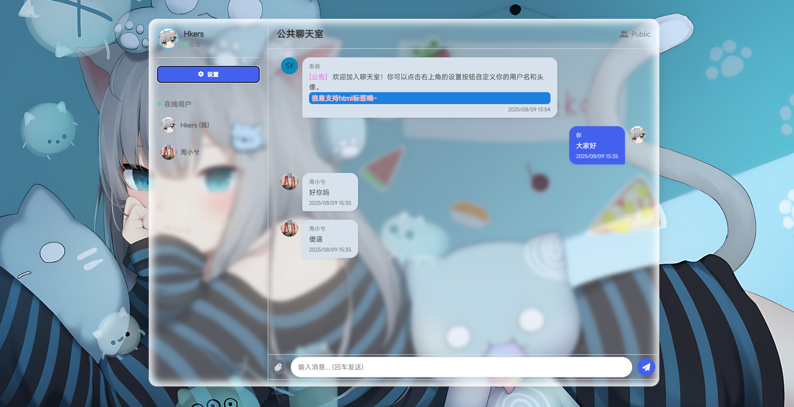
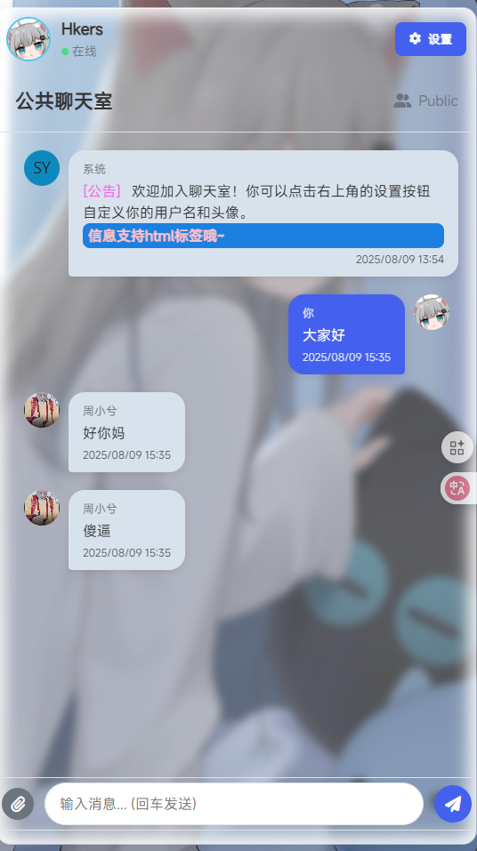

# chat-room  
An online public chat room built with Node.js and spaghetti code  

**⚠️This document is translated by AI. In case of inaccuracies, the Chinese document shall prevail**

**中文文档：[README.md](README.md)**  

**Live Demo: [Online Chat Demo](https://chat.qqaq.top/)**  

  
  

## Quick Start  

1. **Clone the repository**  
```shell
git clone https://github.com/woshimaniubi8/chat-room
cd chat-room
```

2. **Install dependencies**  
**Ubuntu/Debian**:  
```shell
sudo apt update
sudo apt install npm nodejs
npm install
```

**Windows**:  
1. Download Node.js from [Node.js — Download](https://nodejs.org/en/download)  
2. Make sure Node.js and npm are set up, then run:  
```shell
npm install
```

3. **Configure settings**  
`script.js`:  
Set `SRC_URL` and `WS_URL` to your server address (leave blank for same host):  
```javascript
const SRC_URL = '' // Leave blank for same host
const WS_URL = '' // Leave blank for same host
const electron_build = false // Set true for Electron build
```

`index.js`:  
Set `ENABLE_HTTPS` and `PORT` (SSL certificate required for HTTPS):  
```javascript
const ENABLE_HTTPS = false // Enable SSL (requires certificate)
const PORT = 3000 // Server port

if (ENABLE_HTTPS) {
  const pKey = fs.readFileSync('privkey.pem', 'utf8') // Private key
  const cert = fs.readFileSync('fullchain.pem', 'utf8') // Certificate
```

4. **Run the server**  
```shell
npm run start
```
Sample output:  
```shell
$ npm run start

> chat_room@1.0.0 start
> node index.js

服务器运行在 http://localhost:3000
```
Visit the address shown in your browser. Default port is `3000`.  

Access message management at: `your-server-address/message_manage`  

## Additional Notes  
- Background image source: [Nachoneko Wallpapers](https://wallpapercave.com/nachoneko-wallpapers)  
- Built-in font: [Xiaomi - MiSans](https://hyperos.mi.com/font/download)  
- ⚠️ **AdBlock warning**: AdGuard browser extension may block WebSocket connections. Try disabling it if you have connection issues.  
